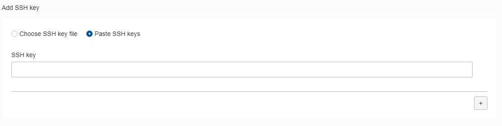

<table class="tbl-heading"><tr><td class="td-logo">

Nov 14, 2019
</td>
<td class="td-banner">
# Lab 3: Prepare Linux "Server" for application deployment
</td></tr><table>

## Introduction

Autonomous Transaction Processing provides all of the performance of the market-leading Oracle Database in an environment that is tuned and optimized for transaction processing workloads. Oracle Autonomous Transaction Processing (or ATP) service provisions in a few minutes and requires very little manual ongoing administration.

## Objectives

- Deploy a Linux server into Oracle Cloud Infrastructure as a preperation step for deploying an application that connects to your Autonomous Transaction Processing Database

## Steps

### **STEP 1: Create a Virtual Cloud Network**

Virutal Cloud Network (VCN) is a private network that you set up in the Oracle data centers, with firewall rules and specific types of communication gateways that you can choose to use. A VCN covers a single, contiguous IPv4 CIDR block of your choice. See [Default Components that Come With Your VCN](https://docs.cloud.oracle.com/iaas/Content/Network/Concepts/overview.htm#Default). The terms virtual cloud network, VCN, and cloud network are used interchangeably in this documentation. For more information, see [VCNs and Subnets](https://docs.cloud.oracle.com/iaas/Content/Network/Tasks/managingVCNs.htm).

- Login to your Oracle Cloud Infrastructure and Click on **Menu** and select **Network** and **Virtual Cloud Networks**.

- Click on Create Virtual Cloud Network to create VCN

- This will bring Create Virtual Cloud Netowrk screen where you will specify the VNC configuration.

- Enter the following in Create Virtual Cloud Network window

**Create In Compartment**: By default, this field displays your current compartment. Please use the **root** compartment during this lab.

**Name**: Enter a name for your cloud network.

Check on **Create Virtual Cloud Network Plus Related Resources** option. By selecting this option, you will be creating a VCN with only public subnets. The dialog expands to list the items that will be created with your cloud network.

- Click on Create Virtual Cloud Network.

A confirmation page displays the details of the cloud network that you just created. The cloud network has the following resources and characteristics (some of which are not listed in the confirmation dialog):
- CIDR block range of 10.0.0.0/16
- An internet gateway
- A route table with a default route rule to enable traffic to and from the internet gateway
- A [default security](https://docs.cloud.oracle.com/iaas/Content/Network/Concepts/securitylists.htm#Default) list
- A public subnet in each availability domain

So you can access the web app in the next lab, we need to allow incoming traffic to enter the VCN on port 3050

- Click on Close and then click on the name of the VCN you just created

    

- Navigate to the Security LIst page by clicking on the **Security Lists** link on the left hand side

    

- Select the Default Security List for your VNC as indicated below

    

- Click on **Edit All Rules** to add a rule into the securitly list that will open port 3050.

    

- In the **Edit Security List Rules** dialog panel that is presented, find a click on **+ Additional Ingress Rule**

     

- Add the following detail to the blank **Ingress Rule** (this will most likely be number as Ingress Rule 4)
    - **Source CIDR** : 0.0.0.0/0
    - **Destination Port Range** : 3050

    

- Finally, scroll down and click the **Save Security List Rules** button to save your rule changes.

    

### **STEP 2: Provision a linux compute VM to serve as the app server**

- Provision a linux compute VM to serve as the app server. 

- Log into your Oracle Cloud Infrastructure and click on Menu and select Compute and Instances.

    

- In order to create Compute Instance we need to select a Compartment. Select **Demo** Compartment which we created in Lab100

- Click on Create Instance

    

Enter the following to Create Linux Instance

- **Name**: Enter a friendly name to identify your linux instance
- **Availability Domain**: Oracle Cloud Infrastructure is hosted in Regions, which are localized geographic areas. Each Region contains three Availability Domains which are isolated and fault-tolerant data centers that can be used to ensure high availability. In the Availability Domain field, select the Availability Domain in which you want to run the instance. For example, scul:PHX-AD-1.
- **Boot Volume**: Oracle-Provided OS Image
- **Image Operating System**: Oracle Linux 7.6
- **Shape Type**: Virtual Machine
- **Shape**: The shape of an instance determines the number of CPUs, the amount of memory, and how much local storage an instance will have. Shape types with names that start with VM are Virtual Machines, while shape types with names that start with BM are Bare Metal instances. Choose the appropriate shape for your Virtual Machine instance in the Shape field. For this lab we will be using, **VM.Standard2.1 (1 OCPU, 15GB RAM)**.
- **Image Version**: Please select the latest version, 2018.09.25-0(latest)
- **Boot Volume Configuration**: When you launch a virtual machine (VM) or bare metal instance based on an Oracle-provided image or custom image, a new boot volume for the instance is created in the same compartment. That boot volume is associated with that instance until you terminate the instance. When you terminate the instance, you can preserve the boot volume and its data, see Terminating an Instance. For this lab we will be using Selected image's default boot volume size: 46.6 GB only.
- **SSH Keys**: If the operating system image for your instance uses SSH keys for authentication (for example, Linux instances), then you must provide an SSH public key. Choose "Paste a public key file, ensure that Choose SSH Key Files is selected, then click Browse. 

    

- Choose the public key to upload (for example, id_rsa.pub), then click Open.

### To create a SSH Key pair (public/private pair) on windows:

- Generate a private and public key pair:
    - Go to the Windows Start menu -> All Programs -> PuTTY and open PuTTYgen
    - Click the 'Generate' button and PuTTYgen will ask you to make some random movement with your mouse until it has enough random data to generate a secure key for you
    - Click the 'Save private key' button and save the resulting file somewhere safe and only accessible by you!
    - Copy the entire contents of the highlighted area in the image below 

        

    - Paste the public key from the previous step back into your browser window in the SSH Key section

        

- **Virtual Cloud Network**: In the Virtual Cloud Network field, select the Virtual Cloud Network for the instance which we created earlier in this lab.
- **Subnet**: In the Subnet field, select the subnet to which to add the instance. For example, the public subnet scul:PHX-AD-1.

That is all you need to enter to create Linux instance on OCI. 

- Click on **Create Instance** at the bottom 

- While the instance is being created, its state is displayed as "PROVISIONING".

- The status changes to "RUNNING" when the instance is fully operational.

- Note the public IP of the machine provisioned so you can SSH on to the server in the next lab

-   You are now ready to move to the next lab.

<table>
<tr><td class="td-logo"></td>
<td class="td-banner">
## Great Work - All Done!
</td>
</tr>
<table>