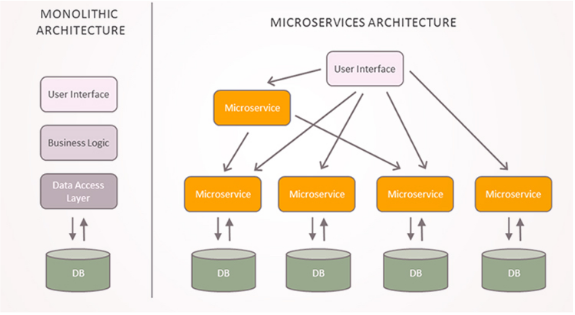
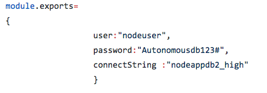

<table class="tbl-heading"><tr><td class="td-logo">

Feb 10 2019
</td>
<td class="td-banner">
# Lab 4: Building microservices on ATP
</td></tr><table>

## Introduction

Containers allow us to package apps along with all their dependencies and provide a light-weight run time environment that provides isolation similar to a virtual machine, but without the added overhead of a full-fledged operating system.

The topic of containers and microservices is a subject on its own but suffice to say that breaking up large,complex software into more manageable pieces that run isolated from each other has many advantages. It's easier to deploy, diagnose and provides better availability since failure of any microservice limits downtime to a portion of the application.



It's important to have a similar strategy in the backend for the database tier. But the issue is if you run multiple databases for each application then you end up having to maintain a large fleet of databases and the maintenance costs can go through the roof. Add to that having to manage security and availability for all of them.

This is where the Oracle’s autonomous database cloud service comes in. It is based on a pluggable architecture similar to application containers where one container database holds multiple pluggable databases. Each of these pluggable databases or PDBs are completely isolated from each other, can be deployed quickly and can be managed as a whole so that you incur the cost of managing a single database while deploying multiple micro services onto these PDBs.

The Autonomous cloud service takes it a step further. It is self managing, self securing and highly available. There is no customer involvement in backing it up, patching it or even tuning it for most part. You simply provision, connect and run your apps. Oracle even provides a 99.995 SLA. That is a maximum of 2 minutes, 11.5 seconds of downtime per month.


To **log issues**, click [here](https://github.com/cloudsolutionhubs/autonomous-transaction-processing/issues/new) to go to the github oracle repository issue submission form.

## Objectives

- To build a docker container running node.js microservice
- Deploy it on an ATP Database service running in the Oracle cloud

#### Note: For simplicity, we will run docker locally on our laptop but it’s also pretty easy to deploy it to Oracle’s Kubernetes cluster service in their cloud, perhaps something you would certainly do for production applications.

## Required Artifacts

- Using the linux server you created in the previous Lab, you will install Docker to download the microservices app used in this lab. See Step 0 for how to do this.
- Download the **instantclient-basic-linux.x64-12.1.0.2.0.zip** from Oracle OTN [here](https://www.oracle.com/technetwork/topics/linuxx86-64soft-092277.html)


Note: Note there are two Docker files in the repository. That’s because we have two different applications–ATPnodeapp and aOne. Both of these are node.js applications which mimic as microservices in our case.

ATPnodeapp simply makes a connection to the ATP database and does not require any schema setup. aOne, on the other hand is a sample marketplace application and requires schema and seed data to be deployed in the backend. If you plan to use that app, you will need to first run the create_schema.sql scripts on the database.

# Steps

## Step -1: Set up schema in ATP for the aOne applicaiton

In SQL Developer, connect to your ATP (assuming you haven't already).

Run the contents of this script:
[create_schema](https://github.com/cloudsolutionhubs/ATPDocker/blob/master/aone/create_schema.sql)

followed by a good 'ole commit for good measure
```
commit;
```

## Step 0: Install Docker on your Linux Server

We will do the remainder of this Lab running as root on the linux server. No, this is not best practice, but for the sake of simplicity we'll do it any way... So, lets switch into the root account.

```
sudo su
```

Lets now connect your instance to the yum repo in the OCI region so we can install Docker and git.

```
yum -y install docker-engine git-all oracle-instantclient18.3-basic
```

Now lets get docker running

```
systemctl enable docker
systemctl start docker
```

Lets pull down the docker image

```
git clone https://github.com/cloudsolutionhubs/ATPDocker.git
```

Penultimately, lets open up the port in the firewall to let you get to the app once its running
```
firewall-cmd --zone=public --permanent --add-port=3050/tcp
```

Finally (at least on the linux server), lets get the latest Oracle Instant Client.

```
cd ATPDocker

wget https://objectstorage.us-phoenix-1.oraclecloud.com/n/apacanzset01/b/alb_adb_rs_software_bucket/o/instantclient-basic-linux.x64-12.1.0.2.0.zip
```

Finally (really this time), 

And, off with the rest of the lab!

### **STEP 1: Provision an ATP instance and copy secure credential file to application folder**

Provision ATP instance and download secure connectivity credentials file.

Refer to labs <a href="./LabGuide100ProvisionAnATPDatabase.md" target="_blank">LabGuide1.md</a> and <a href="./LabGuide200SecureConnectivityAndDataAccess.md" target="_blank">LabGuide2.md</a> to provision and download the secure connectivity credentials file.

- NOTE: If you wish to deploy aOne app, you would need to connect to your database using SQL Developer and run the [create_schema](https://github.com/cloudsolutionhubs/ATPDocker/blob/master/aone/create_schema.sql) script in the default admin schema or create a suitable user schema for the application.

Unzip and store the wallet in same folder as your application under /wallet_NODEAPPDB2. This folder is copied into your container image when you run the docker file.

```
unzip /path_to_wallet_RESTONHUBDB.zip -d /path_to_app_folder/ATPDocker/wallet_NODEAPPDB2/
```

- In your wallet folder, edit sqlnet.ora and replace the contents of the file with the following text: 

```
cd /path_to/ATPDocker/wallet_NODEAPPDB2

nano sqlnet.ora

WALLET_LOCATION = (SOURCE = (METHOD = file) (METHOD_DATA = 
(DIRECTORY=$TNS_ADMIN)))
```

This tells the driver to look for the wallet in the path setup in variable TNS_ADMIN.

### **STEP 2: Build your docker image**

Assuming you have downloaded the Dockerfile, database wallet and created the backend schema, you can now build your docker image.

Move instantclient-basic-linux.x64-12.1.0.2.0.zip to ATPDocker folder.

```
mv /path_to/instantclient-basic-linux.x64-12.1.0.2.0.zip /path_to/ATPDocker/
```

#### Ensure you are in a folder that contains the wallet folder /wallet_NODEAPPDB2 and instantclient-basic-linux.x64-12.1.0.2.0.zip when you run this command

```
cd /path_to_app_folder/ATPDocker/

$ docker build -t aone .
```

Note: -t options gives your image a tag ‘aone’. Don’t forget to include the period in the end. It means use the Dockerfile in the current folder.

You can also specify your dockerfile as,

```
docker build -t atpnodeapp -f Dockerfile2 .
```
#### Note: This will build another app called ATPnodeapp in the image.

Your image should be ready in less than a minute. The entire image is about 400 MB.

The docker creates multiple image files as it builds each layer. Your final image would show at the top of the list and will have the tag you chose.

```
$ docker images -a
```


### **STEP 3: Change Database configuration**

You need to launch your docker image and change the following
- dbuser: admin
- password: WElcome_123#
- connect string: yourdbname_tp 

```

docker run -i -p 3050:3050 -t aone sh

cd /opt/oracle/lib/ATPDocker/aone/scripts

vi dbconfig.js
```



This is the default username, password and connectString wirtten in the app and it will attempt to connect to the database with these credentials along with the secure keystore file. Either create a user with these credentials in your database or change this file to match what you create and save the file.

### **STEP 4: Run server.js app**

Within the docker container navigate to aone folder and run server.js script

```
cd /opt/oracle/lib/ATPDocker/aone/

$ node server.js &
```

Your should get a response similar to this


To check the app on the browser, you have bridged port 3050 on the container to your localhost.

Open browser on your localhost and go to **http://{ip address of you linux server}:3050**

This is what you see if your app ran successfully.


You just built and provisioned an entire application stack consisting of a microservice and an enterprise grade, self managing database. You can push your docker image to a public/private docker repository and it can be pushed to any container orchestration service either on-prem or with any cloud provider. Your database is autonomous –it provisions quickly, backs up, patches and tunes itself as needed.


-   You are now ready to move to the next lab.

<table>
<tr><td class="td-logo">[](#)</td>
<td class="td-banner">
## Great Work - All Done!
</td>
</tr>
<table>